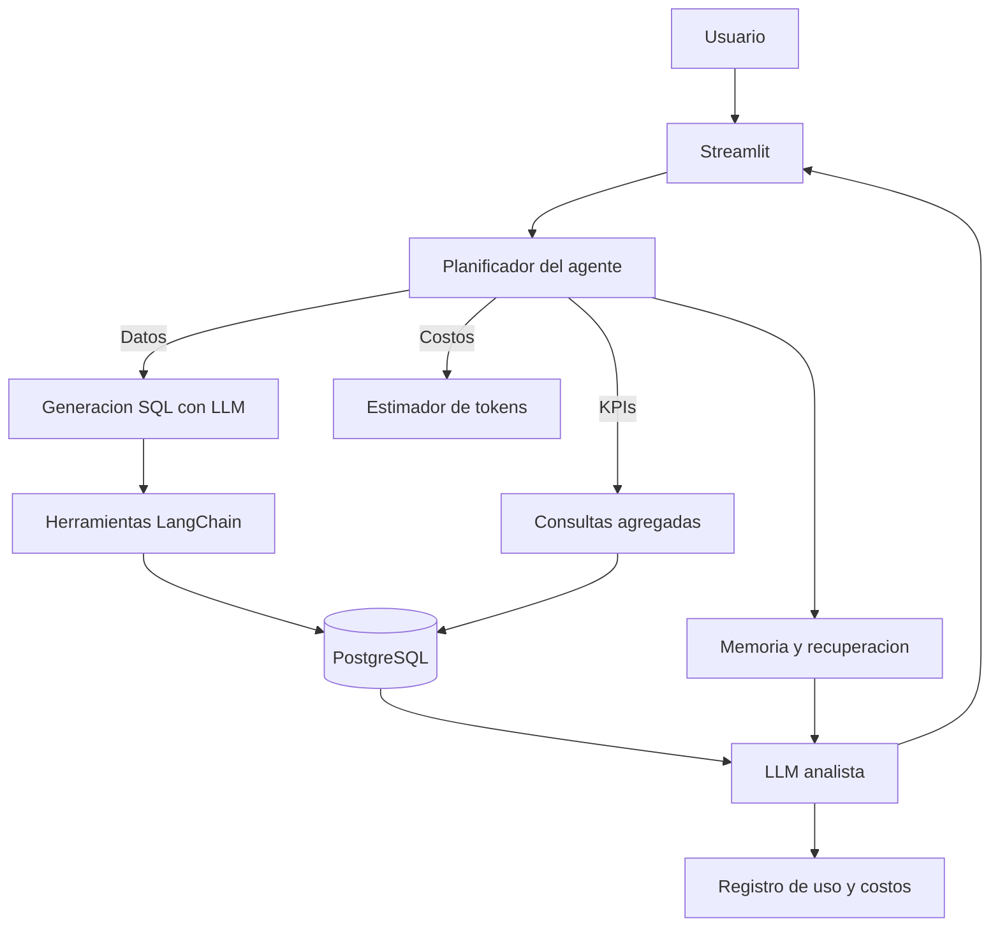

# MadelAgent

Agente inteligente para consultar y analizar datos operacionales de la empresa MADEL mediante lenguaje natural.

El sistema combina un flujo Text-to-SQL con memoria conversacional, herramientas de agente, estimacion de costos por token, evaluacion automatica y analitica historica de ventas e inventario.

## Version actual - EP3

Para la Evaluacion Parcial 3 se incorporaron mejoras orientadas a observabilidad, trazabilidad, seguridad y evidencia de calidad:

- Integracion con LangSmith para registrar trazas, latencia, errores, uso de herramientas y consumo de tokens.
- Dashboard local en Streamlit con metricas de uso, costos estimados, uso reciente y feedback historico.
- Persistencia de feedback en PostgreSQL para evidenciar respuestas utiles y no utiles.
- Registro de tokens y costo teorico por conversacion en la tabla `llm_usage`.
- Validacion de consultas SQL de solo lectura mediante `execute_readonly_sql`.
- Controles basicos para limitar consultas sobre datos sensibles y reforzar el uso responsable del agente.

## Objetivo

MADEL necesita acceder a informacion de stock, ventas, pedidos, sucursales y empleados sin depender de usuarios expertos en SQL. MadelAgent permite que un usuario consulte la base de datos en lenguaje natural y reciba una respuesta interpretada como apoyo a la toma de decisiones.

Ejemplos:

- "Cuanto stock hay en Plaza Sur?"
- "Que productos estan bajo stock minimo?"
- "Que meses muestran mayor demanda de helados?"
- "Genera un reporte de KPIs generales"
- "Cuanto costo esta conversacion en tokens?"

## Framework y enfoque de agente

El proyecto integra LangChain mediante:

- `ChatGroq` como wrapper del modelo LLM.
- `langchain_core.tools.tool` para declarar herramientas del agente.
- Herramientas explicitas para esquema, SQL, memoria, recuperacion de contexto y costos.

El agente mantiene una planificacion simple por rutas:

- Preguntas de datos: genera SQL, ejecuta consulta y explica resultados.
- Preguntas de KPI/reporte: ejecuta consultas agregadas de ventas, inventario y productos.
- Preguntas de costos/tokens: consulta el registro de uso y estima costo teorico.
- Preguntas de seguimiento: usa memoria reciente y memoria recuperada antes de generar SQL.

## Herramientas del agente

Las herramientas estan definidas en `project/backend/src/agents/tools.py`:

- `get_schema`: entrega el esquema disponible para razonamiento SQL.
- `execute_readonly_sql`: ejecuta solo consultas `SELECT`.
- `estimate_query_cost`: estima costo teorico por tokens.
- `save_conversation_memory`: guarda memoria persistente.
- `search_conversation_memory`: recupera contexto relevante.

## Memoria y recuperacion de contexto

El sistema implementa dos niveles:

- Memoria corta: historial de la sesion actual en Streamlit.
- Memoria larga: tabla `conversation_memory` en PostgreSQL.

Antes de responder, el agente recupera:

- ultimos mensajes de la sesion;
- recuerdos relevantes por tema/palabras clave;
- historial visual actual del chat.

Esto permite responder preguntas de seguimiento como "y en Casa Central?" usando el contexto de la conversacion previa.

## Costos estimados

Cada llamada LLM registra:

- modelo;
- tokens de entrada;
- tokens de salida;
- tokens totales;
- costo teorico en USD.

La formula usa tarifas publicas de Groq para `llama-3.3-70b-versatile`:

- Input: USD 0.59 por 1 millon de tokens.
- Output: USD 0.79 por 1 millon de tokens.

Aunque la ejecucion use capa gratuita, esta metrica sirve para proyectar costos de produccion.

## Arquitectura



## Modelo de datos

Tablas principales:

- `sucursales`
- `productos`
- `inventario`
- `proveedores`
- `pedidos`
- `detalle_pedido`
- `ventas`
- `detalle_venta`
- `movimientos_inventario`
- `empleados`
- `turnos`
- `feedback`
- `conversation_memory`
- `llm_usage`

Las tablas `ventas` y `detalle_venta` permiten analisis historico, tendencias, productos mas vendidos, estacionalidad y KPIs.

## Ejecucion

Crear archivo `.env` en `project/`:

```bash
POSTGRES_DB=madel_db
POSTGRES_USER=admin
POSTGRES_PASSWORD=admin123
POSTGRES_PORT=5432
DB_HOST=db
DB_NAME=madel_db
DB_USER=admin
DB_PASSWORD=admin123
DB_PORT=5432
GROQ_API_KEY=tu_api_key
GROQ_MODEL=llama-3.3-70b-versatile
```

Levantar todo:

```bash
cd project/docker
docker-compose down -v
docker-compose up --build
```

Abrir:

```text
http://localhost:8501
```

## Evaluacion

El benchmark esta en `project/eval/dataset.json` e incluye preguntas sobre:

- stock;
- empleados;
- ventas historicas;
- productos bajo stock;
- pedidos;
- demanda estacional;
- KPIs.

Desde la app, el boton **Evaluar sistema** ejecuta el dataset y usa un juez LLM para determinar si la respuesta contiene la informacion esperada.

## Observabilidad

La pestana **Observabilidad** muestra:

- tokens estimados;
- costo teorico acumulado;
- llamadas recientes;
- memoria reciente;
- feedback historico positivo, negativo y sin calificar.

Adicionalmente, el proyecto se conecta a LangSmith mediante variables de entorno para visualizar trazas, latencia P50/P99, tasa de errores, consumo de tokens y uso de herramientas del agente.

Variables sugeridas para LangSmith en `.env`:

```bash
LANGSMITH_TRACING=true
LANGSMITH_API_KEY=tu_langsmith_api_key
LANGSMITH_PROJECT=MadelAgent
```

## Comandos utiles

Levantar todo desde cero:

```bash
cd project/docker
docker-compose down -v
docker-compose up --build
```

Reiniciar solo la app sin tocar la base de datos:

```bash
docker restart madel_app
```

Levantar solo la app sin reconstruir:

```bash
docker compose -f project/docker/docker-compose.yml up -d --no-deps app
```

Reconstruir solo la app:

```bash
docker compose -f project/docker/docker-compose.yml up -d --no-deps --build app
```

## Referencias

- LangChain Groq integration: https://docs.langchain.com/oss/python/integrations/chat/groq/
- LangSmith docs: https://docs.langchain.com/langsmith/home
- Groq pricing: https://groq.com/pricing
